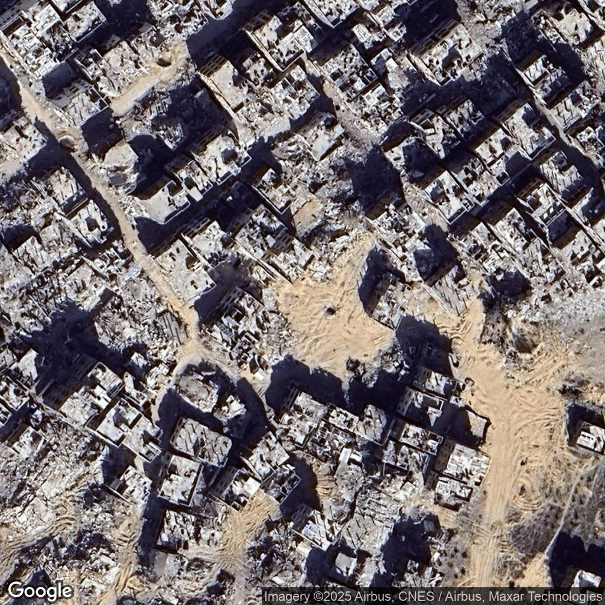
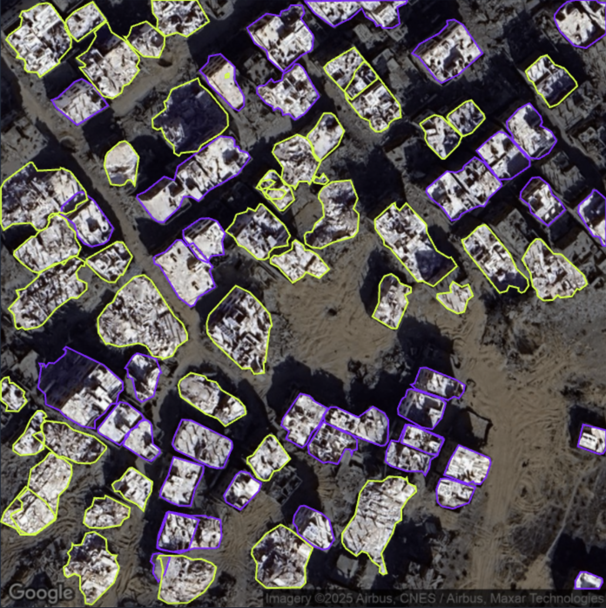
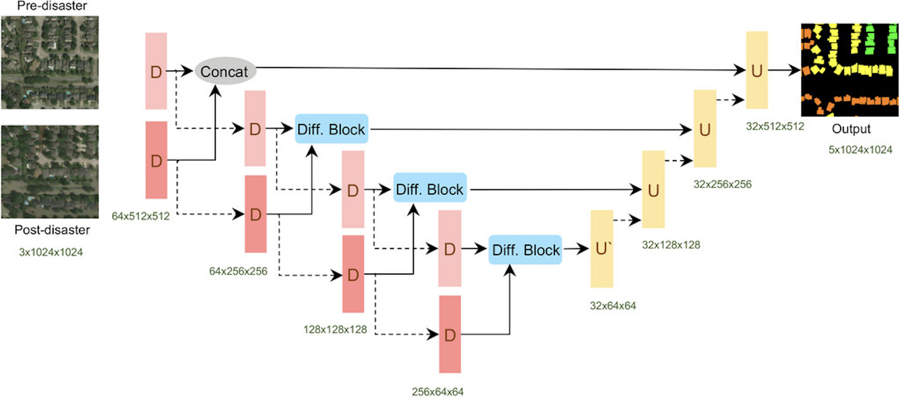
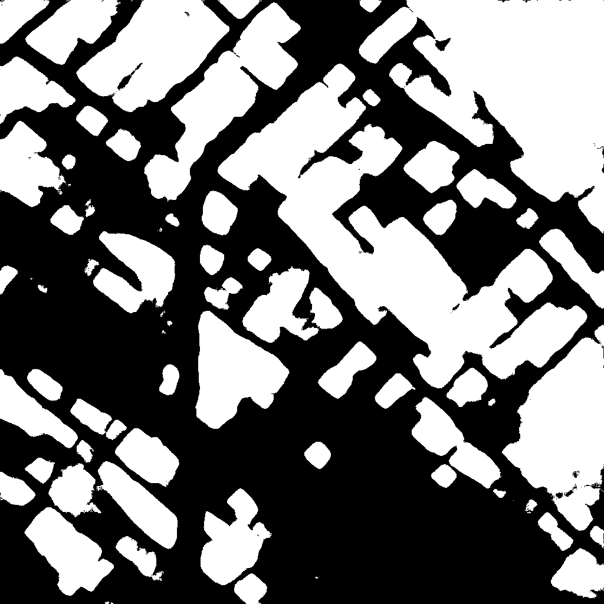
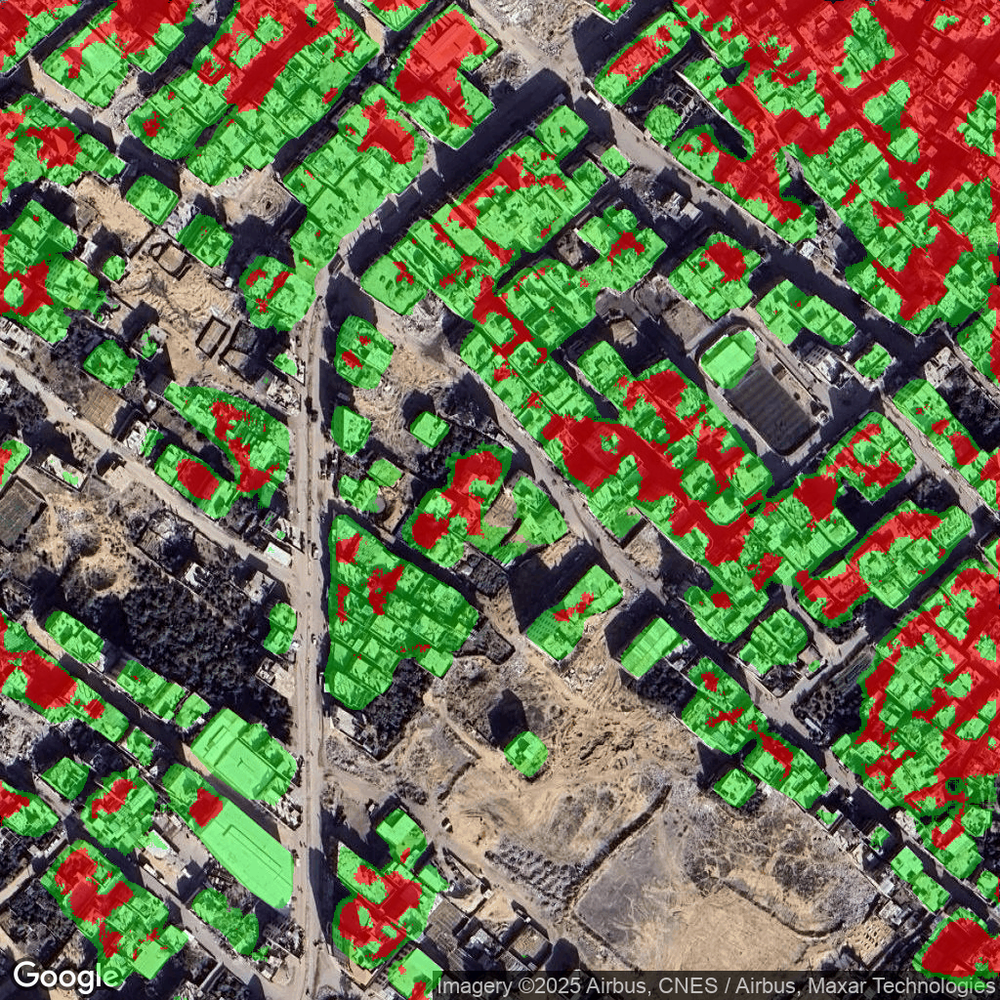
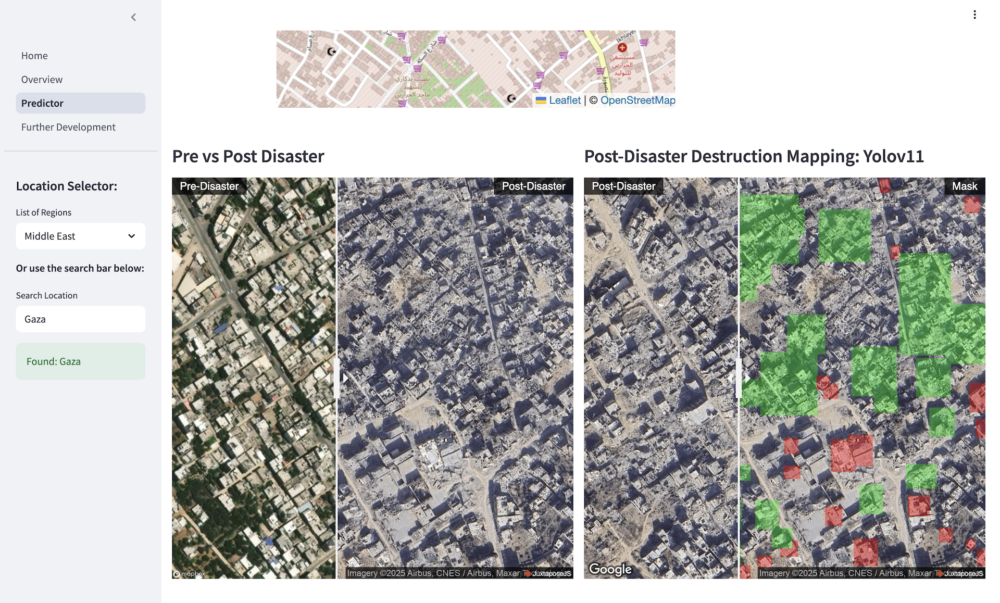
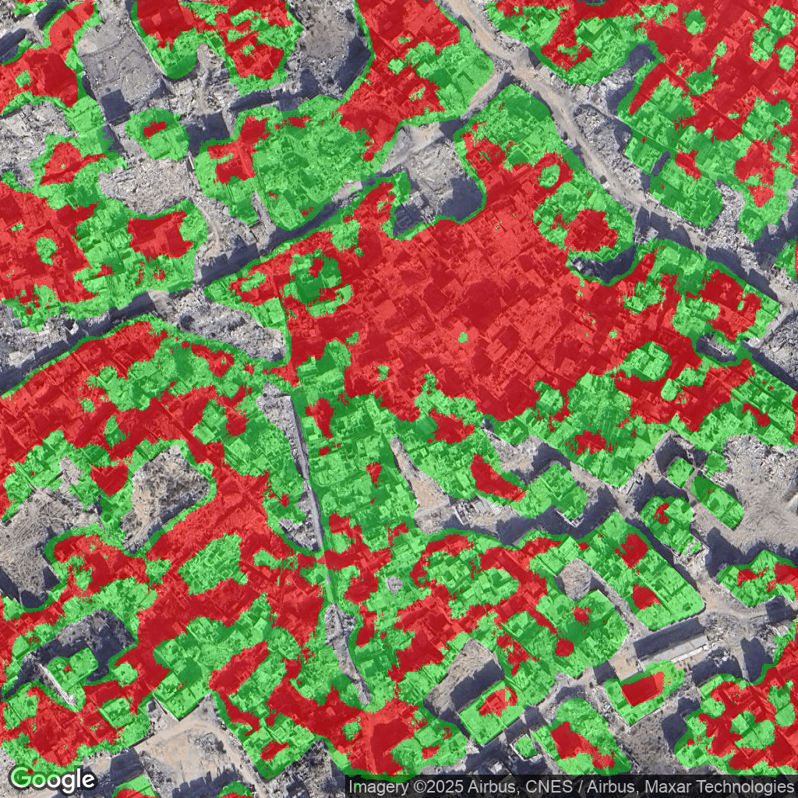

# Orbital Response

## Description

**OUR MISSION:** Harness the power of CNNs and high-frequency, high-resolution satellite imagery to optimise the distribution of humanitarian aid in conflict zones.

We have developed a deep learning architecture for building damage assessment from pre- and post-disaster satellite imagery. By concatenating the images and feeding them as input to two sequential U-Net models (PyTorch), the architecture will output a damage assessment mapping over a 600m² area, centred on a (lat, lon) selected by the user.

The next development will link this building damage to a population density mapping, allowing the number of affected persons to be estimated. This will allow us, through simple linear regression models, to quantify and geolocate requirements for units of humanitarian aid.

## Table of Contents

1. [Dataset](#dataset)
2. [Model Architecture](#model-architecture)
3. [Damage Assessment Mapping](#damage-assessment-mapping)
4. [Further Development](#further-development)
5. [The Team](#the-team)

### Dataset

The dataset consists of 150 manually labelled satellite images, each approximately 300m² in size and 1024x1024 pixels in resolution. These images were extracted from six core areas of building destruction across the Gaza Strip, focusing on key regions affected by conflict.

  
  

*Post-strike satellite image* | *Labelled satellite image (Roboflow)*

## Model Architecture

Orbital Response uses a two-sequential U-Net model architecture with independent encoder-decoder structures:

- **Model A: Building Localisation**
  This model outputs a binary mask to identify building pixels (0 - No Building; 1 - Building).

- **Model B: Damage Classification**
  Using the localisation mask from Model A, this model assigns a binary damage classification to identified building pixels (0 - No Damage; 1 - Damage).

The final output is a segmentation mask where each pixel is classified into one of the following categories:

- 0 - No Building
- 1 - Building - Undamaged
- 2 - Building - Damaged

By overlaying this segmentation mask onto the post-disaster image, the system generates a damage assessment map that provides both visual and geographical damage profiling over an area of 600 square meters.

An additional **Ultralytics YOLOv11 segmentation model** was fine-tuned on the custom dataset and used as a baseline for evaluating the performance of the U-Net model.

*U-Net Architecture*

  
  

*Building Localisation Mask* | *Damage Classification Output*

## Damage Assessment Mapping

The platform requires a singular input – the coordinates (latitude, longitude) for which the 600m² damage mapping will be centred. These coordinates are selected from an interactive map (location selector). Once selected, these coordinates will be used in two separate API calls:

- Mapbox API - Pre-Disaster Satellite Image
- Google Static Map API - Post-Disaster Satellite Image

These images will then be concatenated and fed to both the U-Net architecture and the Ultralytics YOLOv11 model. The outputs of each are shown below:

*Pre vs Post Disaster Images / Ultralytics YOLOv11 Model Output*

*Orbital Response (U-Net) Model Output*

For each output, the green pixels represent an undamaged building, with each red pixel representing a damaged building. As can be seen, the Orbital Response model is identifying and classifying building damage at a far higher accuracy than the YOLOv11 model. The models are each only trained on 150 manually labelled images, so to achieve this level of assessment mapping is very positive.

## Further Development

1. **Improved Model Accuracy and Generalisation**
   The current goal is to expand the dataset to 1000 manually labelled images (covering 25% of the Gaza Strip). Once this is achieved, the model will be generalized to additional conflict zones, starting with Ukraine. Collaborations with organizations like Maxar will provide higher resolution and more time-specific satellite imagery, significantly improving model accuracy.

2. **Quantifying Specific Units of Humanitarian Aid**
   The next step is to incorporate a population density map to estimate the number of affected individuals based on each pixel's assigned damage classification. Using regression models, the following units of humanitarian aid will be predicted:
   - Units of shelter
   - Units of food and water
   - Units of medical aid

3. **Quantifying Economic Damage and Reconstruction Costs**
   Future plans include assessing the economic damage and estimating the cost of reconstruction for the affected areas.

## The Team

- **[Ben Shaw](https://www.linkedin.com/in/bencshaw/)**

- **[Christian Miro](https://www.linkedin.com/in/christianmiro)**

- **[Felix Pless](https://www.linkedin.com/in/felixpless)**

